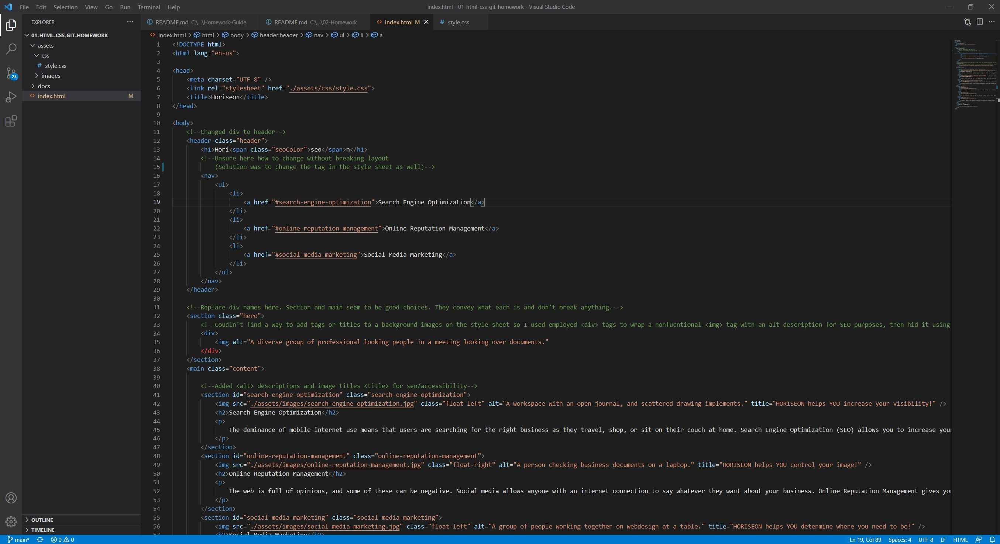

# html-css-git
Code Refactor homework assignment.

An early practice "job ticket" style project. The goals of which were to review the index and style sheets and make sure that 
they followed proper coding semantics, as well as accessbility standards. 

Deployed:
https://dearg-amadaun.github.io/01-html-css-git-homework/

